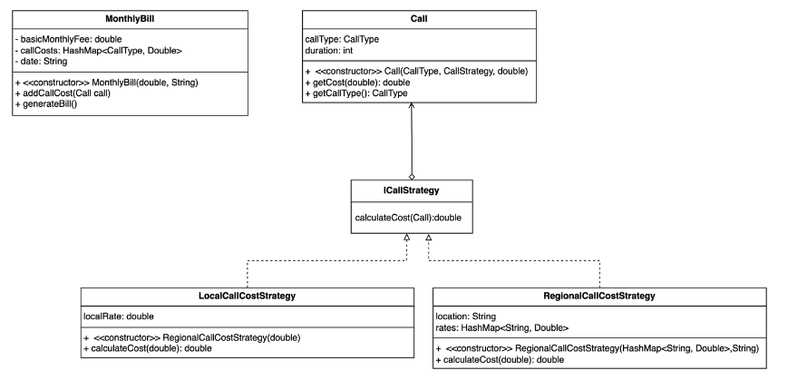

# MercapChallenge

Realizar un sistema de facturación de llamadas telefónicas teniendo en cuenta los siguientes
requerimientos:

1. La facturación se realiza de manera mensual
2. La facturación está compuesta por:
   a. Un abono mensual básico
   b. Consumo por llamadas Locales
   c. Consumo por llamadas Nacionales e Internacionales
3. Las llamadas locales tienen distintos valores según la franja horaria en la que se
   realizan y el día. Para los **días hábiles**, de **8 a 20 hrs**. el costo es de **0,20 centavos** el
   minuto, mientras en **el resto** de las horas es de **0,10 centavos** el minuto. Los sábados
   y domingos cuesta 0,10 centavos el minuto
4. Las **llamadas Internacionales** tienen un **costo** distinto **según el país** al que se llame
5. Las **llamadas Nacionales** tienen un **costo** distinto **según** **la localidad** a la que se
   llame.

## Diagrama UML de la solución



## Descripcion de la solución

La solución propuesta se basa en el patrón de diseño strategy para calcular los costos de las llamadas telefónicas según el algoritmo que se necesite. Se separaron los tipos de llamadas en dos tipos de estrategias:

- Las llamadas locales, implementadas en la clase LocalCallCostStrategy, que cubren los casos en los que para distintas franjas horarias y días se necesitan diferentes tarifas. Esta estrategia utiliza una tarifa fija que se multiplica por la duración de la llamada para calcular el costo.

- Las llamadas regionales (nacionales e internacionales), implementadas en la clase RegionalCallCostStrategy, que manejan los casos en los que el costo de la llamada varía según la provincia o el país al que se llama. Esta estrategia utiliza un mapa de tarifas por región que se multiplica por la duración de la llamada para calcular el costo.

Ambas estrategias implementan la interfaz ICallStrategy, que define un método calculateCost que toma la duración de la llamada y devuelve el costo de la llamada.

De esta manera separamos las responsabilidades haciendo que cuando le pasamos una llamada a la factura con el metodo AddCallCost, la misma solo obtiene el tipo de llamada con el metodo getCallType para conocer a que campo atribuir el costo y finalmente al metodo getCost para que la llamada indique el costo de la misma.

## Ejecución con Docker

```
docker build -t billing-mercap . && docker run -it --rm billing-mercap
```

## Ejecución local

Compilación utilizando javac

```
javac src/**/*.java
```

Ejecución

```
java -cp src service.Main
```
